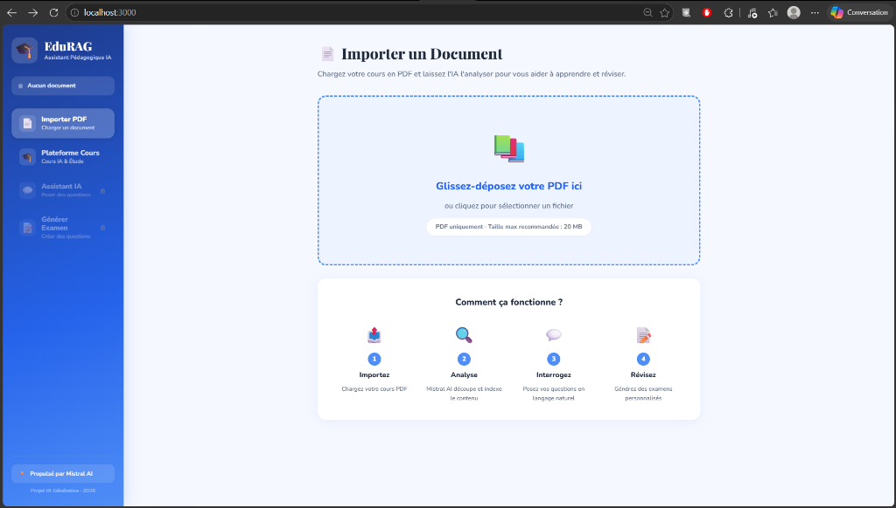
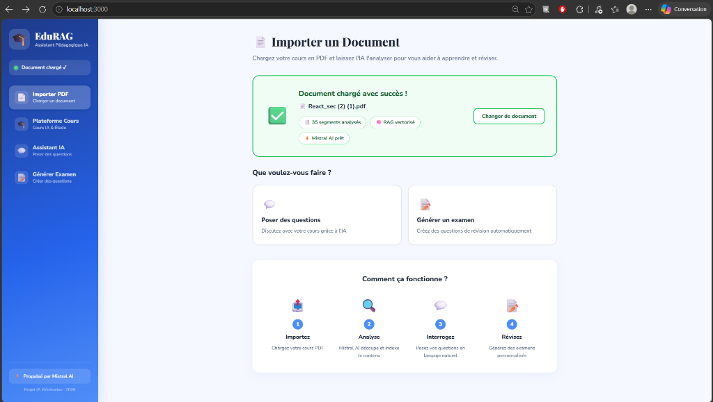
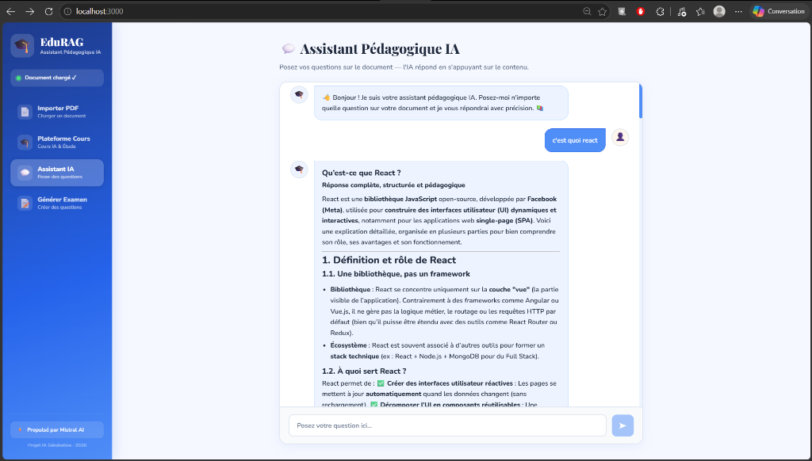
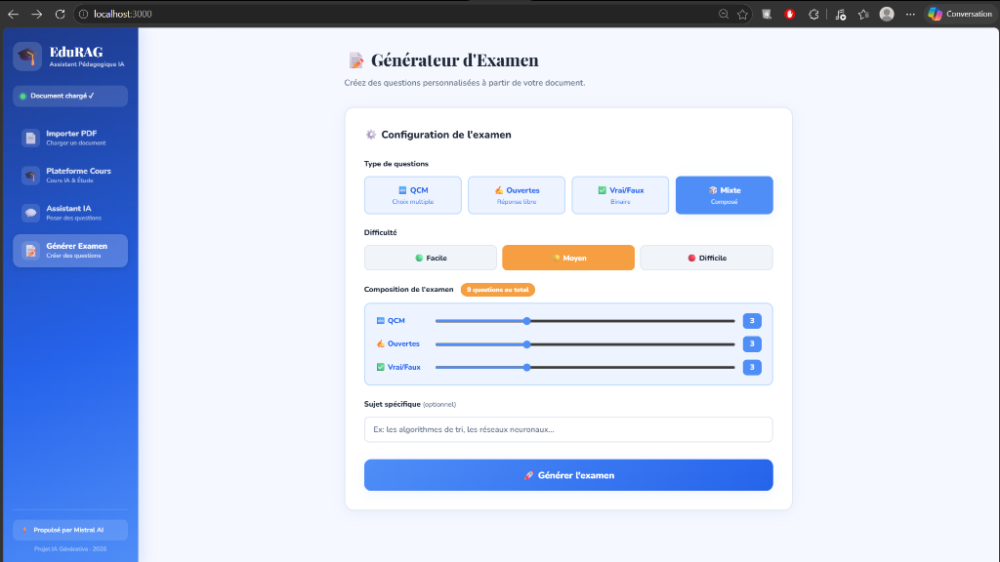
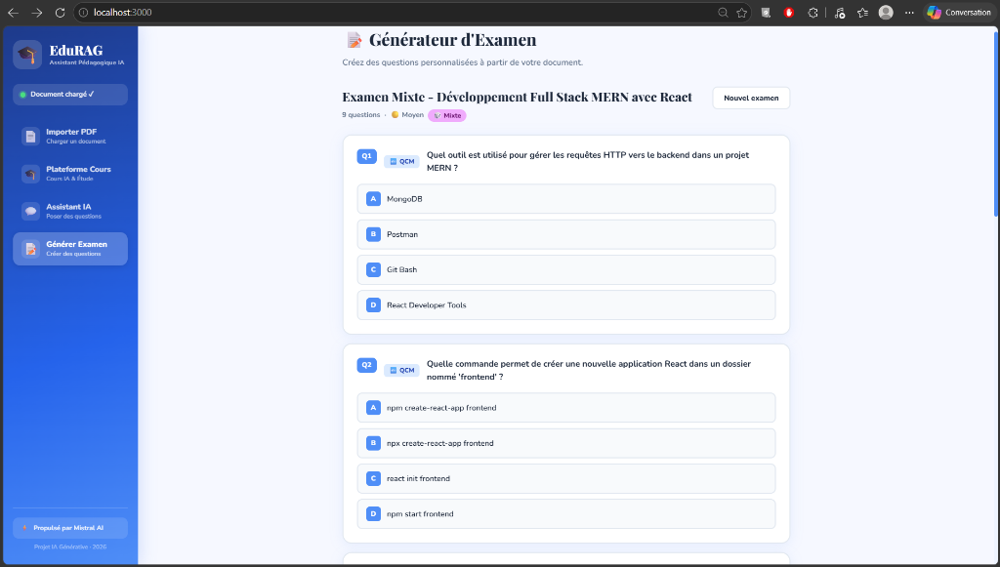

# 🎓 EduRAG – Assistant Pédagogique IA

> Plateforme intelligente combinant **RAG (Retrieval-Augmented Generation)**, **génération automatique d'examens** et **création de cours par IA**, propulsée par **Mistral AI**.

---

## 📸 Aperçu

### 📄 Import de Document & Analyse

*Interface d'accueil pour l'import de documents PDF.*


*Confirmation de l'analyse et de la vectorisation du document par le RAG.*

### 💬 Assistant Pédagogique RAG (Chatbot)

*Chat interactif avec sources citées pour réviser le cours.*

### 📝 Générateur d'Examens & Quiz

*Formulaire de configuration du niveau de difficulté et du type de questions.*


*Examen mixte généré automatiquement par l'IA.*

---

## ✨ Fonctionnalités

- **📤 Import PDF intelligent** — Upload par drag & drop, extraction et vectorisation automatique
- **🎓 Génération de cours par IA** — Création de cours magistraux complets en Markdown sur n'importe quel sujet
- **💬 Chatbot RAG** — Questions-réponses contextuelles avec sources citées
- **📝 Génération d'examens** — QCM, questions ouvertes, Vrai/Faux avec corrections
- **🗂️ Flashcards interactives** — Cartes mémo 3D extraites automatiquement du cours généré
- **🎯 Difficulté adaptable** — Facile / Moyen / Difficile
- **📊 Score automatique** — Correction instantanée avec explications
- **⚡ Propulsé par Mistral AI** — LLM et Embeddings Mistral pour toutes les fonctionnalités

---

## 🏗️ Architecture

```
┌─────────────────────────────────────────────────┐
│               Interface React (Frontend)         │
│ Upload │ Cours IA │ Chatbot RAG │ Examen         │
└──────────────────┬──────────────────────────────┘
                   │ REST API (Axios)
┌──────────────────▼──────────────────────────────┐
│              FastAPI (Backend)                   │
│ /upload-pdf │ /generate-course │ /chat │ /exam   │
└────┬──────────────┬──────────────┬──────────────┘
     │              │              │
┌────▼───────┐ ┌────▼────────┐ ┌──▼──────────────┐
│ RAG System │ │ Course Gen  │ │ Exam Generator  │
│ LangChain  │ │ Mistral LLM │ │ Mistral Large   │
│ FAISS      │ │ Markdown    │ │ JSON structured │
│ Embeddings │ │             │ │ output          │
└────────────┘ └─────────────┘ └─────────────────┘
```

---

## 🛠️ Stack Technique

| Composant | Technologie |
|-----------|-------------|
| Frontend | React 18, CSS3, React Dropzone, React Markdown, Framer Motion |
| Backend | FastAPI, Python 3.10+ |
| LLM | Mistral Large Latest |
| Embeddings | mistral-embed |
| RAG | LangChain + FAISS |
| PDF Parser | PyMuPDF (fitz) |

---

## 🚀 Installation et Lancement

### Prérequis
- Python 3.10+
- Node.js 18+
- Clé API Mistral (gratuite sur [console.mistral.ai](https://console.mistral.ai))

### 1. Cloner le projet

```bash
git clone https://github.com/VOTRE_USERNAME/edurag-projet.git
cd edurag-projet
```

### 2. Backend

```bash
cd backend
pip install -r requirements.txt
cp .env.example .env
# Éditez .env et ajoutez votre clé MISTRAL_API_KEY
python main.py
```

Le backend démarre sur `http://localhost:8000`

### 3. Frontend

```bash
cd frontend
npm install
cp .env.example .env
npm start
```

L'application s'ouvre sur `http://localhost:3000`

---

## 📖 Guide d'utilisation

1. **Importer un PDF** — Glissez votre cours sur la page d'accueil
2. **Attendre l'analyse** — Mistral AI vectorise le contenu (10-30 secondes)
3. **Poser des questions** — Allez dans "Assistant IA" et posez vos questions
4. **Générer un examen** — Allez dans "Générer Examen", configurez et lancez
5. **Créer un cours IA** — Allez dans "Plateforme Cours", saisissez un sujet et générez

---

## 📁 Structure du projet

```
edurag-projet/
├── backend/
│   ├── main.py              # API FastAPI (routes REST)
│   ├── rag.py               # Système RAG (LangChain + FAISS + Mistral)
│   ├── exam_generator.py    # Générateur d'examens (QCM, ouvert, V/F, mixte)
│   ├── course_generator.py  # Générateur de cours magistraux par IA
│   ├── test_rag.py          # Tests d'intégration automatisés
│   ├── requirements.txt
│   └── .env.example
├── frontend/
│   ├── public/
│   │   └── index.html
│   ├── src/
│   │   ├── components/
│   │   │   ├── Sidebar.js
│   │   │   └── Sidebar.css
│   │   ├── pages/
│   │   │   ├── UploadPage.js / .css
│   │   │   ├── CoursesPage.js / .css
│   │   │   ├── ChatPage.js / .css
│   │   │   └── ExamPage.js / .css
│   │   ├── App.js
│   │   └── index.js
│   ├── package.json
│   └── .env.example
└── README.md
```

---

## 👥 Étudiants

**Classe :** 2TA DAD

| Nom | Prénom |
|-----|--------|
| HAJJI | Nayssem |
| KHEMISSI | Eya |

> **Module :** IA Générative  
> **Date :** Mai 2026  
> **Deadline :** 31 mai 2026

---

## 📄 Licence

Projet académique .
